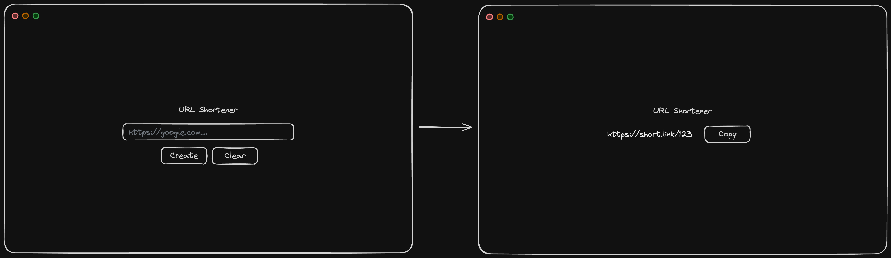
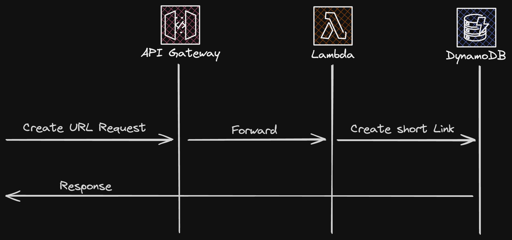
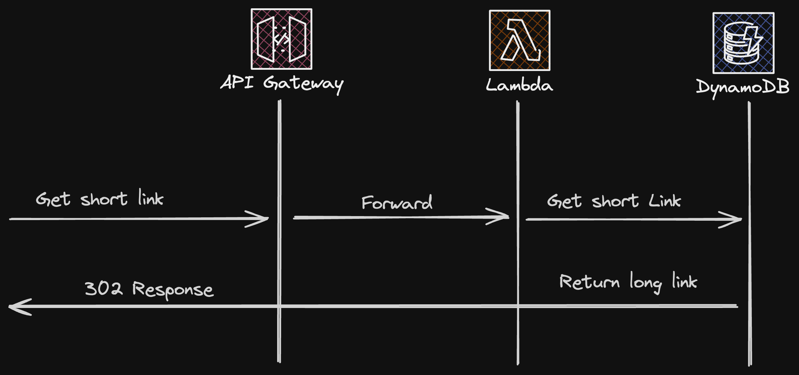

# URL Shortener

A URL shortener is a service that allows users to create a short version of an URL. It has a simple interface that allows users to put their links into the system and get back a shorter url with a unique identifier.

## Functional Requirements

1. **Shorten URLs**: The system should be able to shorten URLs by creating a unique identifier for each URL.
2. **Redirect to Original URL**: The system should be able to redirect users to the original URL when they access the shortened URL.
3. **Handle Errors**: The system should be able to handle errors gracefully.

## Non-Functional Requirements

1. **High Availability**: The system should be available for use 24/7.
2. **Scalability**: The system should be able to handle a large number of requests.
3. **Reliability**: The system should not lose data or become unresponsive.

## Implementation

### Create Short URL

### Get Short URL

